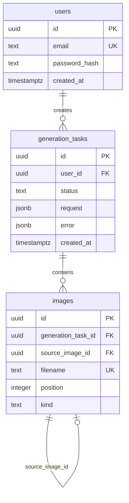

# PostgreSQL 建模：从用户到图片库的关系设计

> 本文对应 AIGC Creative Studio 当前的 PostgreSQL 17 Schema，重点讨论多用户图片库如何建模、为什么任务和图片要拆表，以及如何让“编辑作品”能够追溯来源。

## 一、先定义领域对象，而不是先定义表

在图片创作项目里，最容易出现的错误是把所有信息塞到一张 `images` 表：Prompt、任务状态、图片地址、用户、编辑记录全放一起。这样早期看似简单，后续一条任务生成多图、编辑作品回存、失败任务展示、用户隔离都会变得困难。

本项目先定义三个稳定实体：

```text
用户(User)
  └─ 生成任务(GenerationTask)
       └─ 图片(Image)
            └─ 可选地引用另一张图片作为编辑来源
```

对应关系：



## 二、users：身份只保存必要信息

`users` 表包含：

- `id uuid primary key`：内部稳定主键；
- `email text unique not null`：登录标识和唯一约束；
- `password_hash text not null`：bcryptjs 哈希值，绝不保存明文密码；
- `created_at timestamptz`：统一用带时区时间；
- `updated_at timestamptz`：账户资料未来扩展的基础。

不要用 email 当作其他表外键。邮箱虽然看起来唯一，但它是用户可修改的业务字段；UUID 是更稳定的内部关联键。

## 三、generation_tasks：把一次“创作意图”持久化下来

生成任务表记录的是一次生成请求，而非某一张具体图片。

| 字段 | 作用 |
| --- | --- |
| `id` | 前端轮询使用的 taskId |
| `user_id` | 所属用户，外键指向 `users.id` |
| `status` | `pending`、`processing`、`succeeded`、`failed` |
| `request jsonb` | prompt、比例、数量、seed、风格等原始请求 |
| `error jsonb` | 安全的错误 code/message/retryable |
| `provider` / `provider_task_id` | 为多 Provider 和外部任务追踪预留 |
| `created_at` / `completed_at` | 任务耗时、排序和审计依据 |

### 为什么 request 使用 JSONB

生成参数会随模型能力变化：今天有 `seed` 和 `style`，明天可能增加参考图、模型版本、采样步数。把整份经过校验的请求存为 JSONB 可以保留历史语义，也能减少频繁改表。

但 JSONB 不是“所有字段都不用建列”。会用于过滤、排序、关联或唯一约束的字段仍应成为普通列。例如 `user_id`、`status`、`created_at` 都是列，因为它们会参与图片库查询。

## 四、images：把一对多关系和编辑溯源说清楚

一条生成任务可能返回多张图片，也可能包含用户保存回来的编辑 PNG。因此 `images` 单独成表：

| 字段 | 作用 |
| --- | --- |
| `id` | 图片记录主键 |
| `generation_task_id` | 所属生成任务 |
| `filename` | 本地文件名，而不是服务器绝对路径 |
| `mime_type` | 图片类型 |
| `kind` | `generated` 或 `edited` |
| `position` | 当前任务内稳定展示顺序 |
| `source_image_id` | 编辑作品的来源图片，可空 |
| `created_at` | 图片生成或保存时间 |

文件二进制在 `server/storage/images/`，数据库只存元数据与安全的文件标识。这比把图片直接塞入 `bytea` 更适合当前单机学习项目：查询列表轻、图片服务清晰、数据库备份体积可控。

### 为什么要使用 position，而不是数组索引

HTTP 路由里常见 `:imageIndex`，但数据库不应把数组下标当长期 ID。用户删除第 0 张图后，后面的数组索引会发生变化。项目通过 `images.position` 明确排序，并保证 `(generation_task_id, position)` 唯一；查询时按 position 排序，再向前端输出当前索引。

删除接口必须先根据“任务 + 当前位置”找出具体图片记录，再删文件、删元数据并重新整理余下 position。这样能保证下一次列表和编辑入口不会指向错误图片。

## 五、外键策略：数据完整性优先

当前 Schema 使用：

```sql
generation_tasks.user_id
  references users(id) on delete cascade;

images.generation_task_id
  references generation_tasks(id) on delete cascade;

images.source_image_id
  references images(id) on delete set null;
```

这三条规则分别表达：

1. 删除用户，连同该用户任务一起删除；
2. 删除任务，任务下所有图片元数据也删除；
3. 删除原始图片时，不连带删除已经保存的编辑作品，只让其来源引用变为空。

第三点很重要：编辑作品是用户主动保存的新成果，不应因为源图删除而自动消失。

## 六、索引如何服务真实查询

项目不是为了“看起来专业”而加索引，而是围绕现有访问模式：

```sql
create index generation_tasks_user_created_at_idx
  on generation_tasks(user_id, created_at desc);

create index generation_tasks_user_status_created_at_idx
  on generation_tasks(user_id, status, created_at desc);

create index images_generation_task_position_idx
  on images(generation_task_id, position);
```

- 图片库按当前用户、创建时间倒序加载：命中第一个索引；
- 按 succeeded / failed 等状态筛选：命中第二个索引；
- 获取任务下全部图片并保持顺序：命中第三个索引。

面试时可以明确说：索引不是越多越好。写入任务、保存图片和删除图片时也要维护索引，应该根据 `EXPLAIN ANALYZE` 和真实数据量调整。

## 七、事务与一致性：读取和写入都要考虑半成品

查询任务时，项目使用只读 `REPEATABLE READ` 事务读取任务和图片。这样一次 API 响应不会出现“任务是成功状态，但图片列表正好读到更新前”的混合快照。

保存编辑图片时要先完成 PNG 签名校验、文件落盘，再更新数据库元数据。若元数据写入失败，应删除刚写入的文件，避免留下不可追踪的孤儿文件。反过来，删除图片应先校验所有权，再删除本地文件与元数据；当文件已不存在时依然要清理数据库记录。

单机文件系统与数据库不能形成真正的分布式事务，因此需要通过顺序、补偿操作和安全日志将“不一致窗口”压到最小。生产环境可进一步引入对象存储、后台清理任务和 outbox 模式。

## 八、如何在 pgAdmin 中看懂这套表

打开 `aigc_studio → Schemas → public → Tables` 后可以看到：

- `users`：注册用户；
- `generation_tasks`：每次提交的创作任务；
- `images`：任务产生或编辑保存的图片元数据。

可用下面的只读 SQL 查看某个用户的图库：

```sql
select
  t.id as task_id,
  t.status,
  t.created_at,
  i.filename,
  i.kind,
  i.position
from generation_tasks t
left join images i on i.generation_task_id = t.id
where t.user_id = '替换为用户 UUID'
order by t.created_at desc, i.position asc;
```

## 结语

一套可扩展的 AIGC 数据模型，不是“有三张表”这么简单，而是明确三种边界：用户归属、生成任务、图片资产。任务保存创作意图，图片保存可展示资产，外键与索引保证关联正确且查询可用。这个模型既能支撑当前本地项目，也为未来的对象存储、队列和多模型 Provider 留出了演进空间。
