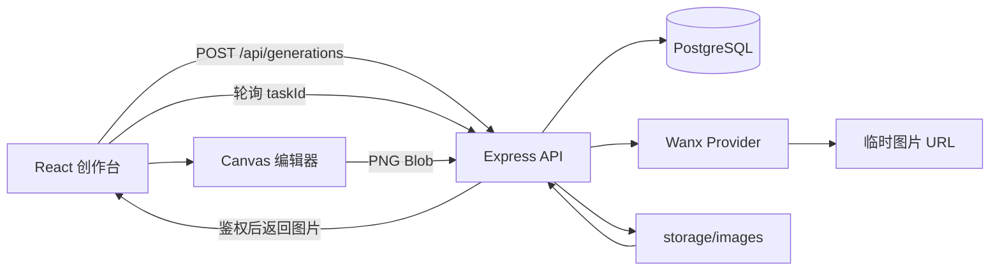

# 全栈面试项目讲解：如何讲清 AIGC Creative Studio

> 这不是项目 README，而是一份面试讲解稿。目标是让你用 3 分钟、10 分钟和深挖追问三个层次讲清一个 AIGC 全栈项目，而不是只说“我调了一个生图 API”。

## 一、30 秒项目介绍

我做了一个 AIGC 图片创作工作台。前端使用 React、TypeScript 和 Canvas 2D API，支持 Prompt 生图、任务状态轮询、生成库、图片下载，以及黑白、灰度渐变、雨滴、色彩涟漪等编辑效果；后端使用 Express、TypeScript、PostgreSQL 和 Provider 抽象层对接 Wanx。生成结果会从 Provider 临时 URL 下载并保存到本地文件系统，任务和图片元数据按用户持久化到 PostgreSQL。系统还有注册登录、图片所有权校验、编辑 PNG 保存回图库和本地导入素材的 IndexedDB 支持。

## 二、3 分钟讲解：按一次真实用户操作展开

### 1. 用户提交生成请求

前端表单收集 Prompt、负向 Prompt、比例、风格、数量和 Seed。提交前把中文风格映射成后端可识别的枚举值。后端对所有字段做严格校验，非法请求直接返回 `400`，不会调用模型服务。

### 2. 后端立即创建异步任务

后端在 PostgreSQL 创建 `pending` 任务并返回 `202 + taskId`，然后在后台调用 `ImageGenerationProvider`。这样请求不会被模型耗时阻塞，前端可以根据 taskId 轮询状态。

### 3. 成功后转存图片

Provider 成功返回的是临时 URL。服务端只下载这次任务自身返回的 URL，保存到 `server/storage/images`，然后将数据库图片记录的 filename 映射为受保护的 `/api/images/:filename` 访问地址。只有文件落盘和数据库记录成功后，任务才会进入 `succeeded`。

### 4. 用户查看和编辑

生成库按当前用户查询任务和图片。图片访问接口会再次校验 ownership，不能因为猜到 filename 就读取别人的文件。进入编辑器后，Canvas 基于原始 ImageData 重绘各种效果，导出 PNG 或上传编辑后的 PNG 回到同一任务图片列表。

## 三、架构图：面试时可以这样画

## 四、最能体现全栈能力的五个设计点

### 1. 异步任务而不是同步长连接

图片生成是长耗时外部调用。我把它建模为 `pending → processing → succeeded/failed` 的任务状态机，接口创建任务后立刻返回，让前端用受控轮询获取结果。这样即使用户离开创作页，也能在生成库看到任务状态。

### 2. Provider 适配层

生成路由不直接依赖 Wanx 的请求格式。业务层只面对 `ImageGenerationProvider.generate()`，DashScope 的模型名、尺寸、异步任务轮询和错误格式都封装在 Provider 内，方便替换平台。

### 3. PostgreSQL 关系建模

用 `users → generation_tasks → images` 处理用户隔离、一条任务多图和编辑图片回存；编辑图片通过 `source_image_id` 可选引用来源。关键查询索引围绕 `user_id + status + created_at` 建立。

### 4. 图片不只是一条 URL

模型 URL 会过期，且不受项目权限体系控制。因此生成后由服务端下载并本地化，数据库只存文件名与元数据。读取图片前通过任务的 `user_id` 校验归属，避免直接静态目录暴露。

### 5. Canvas 算法真正运行在像素层

灰度按 `0.299R + 0.587G + 0.114B` 计算；灰度渐变按横坐标和 smoothstep 计算彩色混合比例；雨滴使用稳定伪随机粒子池和 `requestAnimationFrame`；色彩涟漪用离屏彩色/灰度 Canvas 实现区域揭色。所有效果都从原始 ImageData 重新计算，避免累计失真。

## 五、常见追问与回答要点

| 追问 | 回答重点 |
| --- | --- |
| 为什么不用 `setInterval` 轮询？ | 递归 `setTimeout` 能确保上次请求结束后再发下一次，防并发堆积；卸载、任务切换和终态时清理。 |
| Provider 失败怎么办？ | 写入 `failed`、安全错误信息和 completedAt；不暴露密钥，前端可展示原因并允许重试。 |
| 为什么不是把图片存数据库？ | 当前学习项目用本地文件系统保存二进制、Postgres 存元数据，查询更轻；生产可转对象存储。 |
| 多用户如何隔离？ | 每条任务有 user_id，所有任务/图片读取和修改都带当前用户条件；图片预览接口也鉴权。 |
| Canvas 如何避免跨域导出失败？ | 服务端允许带凭据 CORS，受保护图片用 `crossOrigin = 'use-credentials'` 加载，避免未带 Cookie 导致 401。 |
| 数据库与文件保存不一致怎么办？ | 使用明确顺序和补偿：文件成功再写元数据，元数据失败则删除文件；生产再补后台对账。 |

## 六、坦诚说明当前边界，反而更加分

这个项目是单机可复现的学习与面试案例，不把它包装成已经具备大规模生产能力的 SaaS。当前明确边界包括：

- 后台生成在 Express 进程内执行，尚未使用独立队列 Worker；
- 图片二进制存本地磁盘，尚未接对象存储；
- 临时任务轮询未升级为 SSE/WebSocket；
- 本地导入素材保存在浏览器 IndexedDB，不会上云；
- WebM 动态效果只下载到客户端，不回存服务端。

接下来会按“队列化、对象存储、可观测性、限流与配额、部署环境分离”的顺序演进，而不是堆叠无关功能。

## 七、面试演示顺序建议

1. 登录一个测试用户，说明任务、图片数据按用户隔离；
2. 提交一个 Prompt，展示返回 taskId 与状态变化；
3. 在生成库打开图片、下载并进入编辑器；
4. 演示一个 Canvas 效果和保存回图库；
5. 打开 pgAdmin，展示三张表的关联；
6. 解释为什么临时 Provider URL 被转存为本地文件；
7. 最后说明尚未实现的生产能力与下一步计划。

这套顺序能把“前端体验、后端任务、数据库、文件安全、图像算法”串成一个完整故事。

## 结语

面试项目的价值不在于功能数量，而在于能否解释每个关键取舍：为什么任务要异步、为什么要建表关系、为什么图片要本地化、为什么资源访问还要授权、为什么 Canvas 从原始像素重算。只要这条链路讲清楚，这个项目就能作为一个扎实的全栈 AIGC 案例。
